# SDBox Mini for Amiga
SDBox in a standard DB25 plastic shell
***
Rev. 2B <br />
<a href="images/SDBox-mini_pic20.jpg">
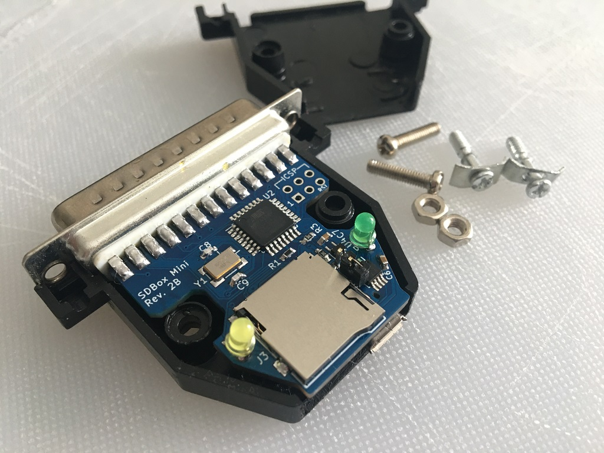
</a>
<a href="images/SDBox-mini_pic21.jpg">
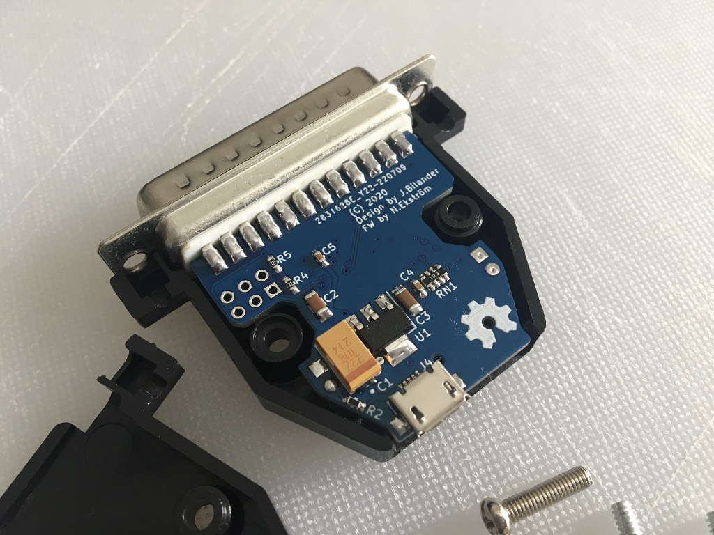
</a>
<a href="images/SDBox-mini_pic22.jpg">
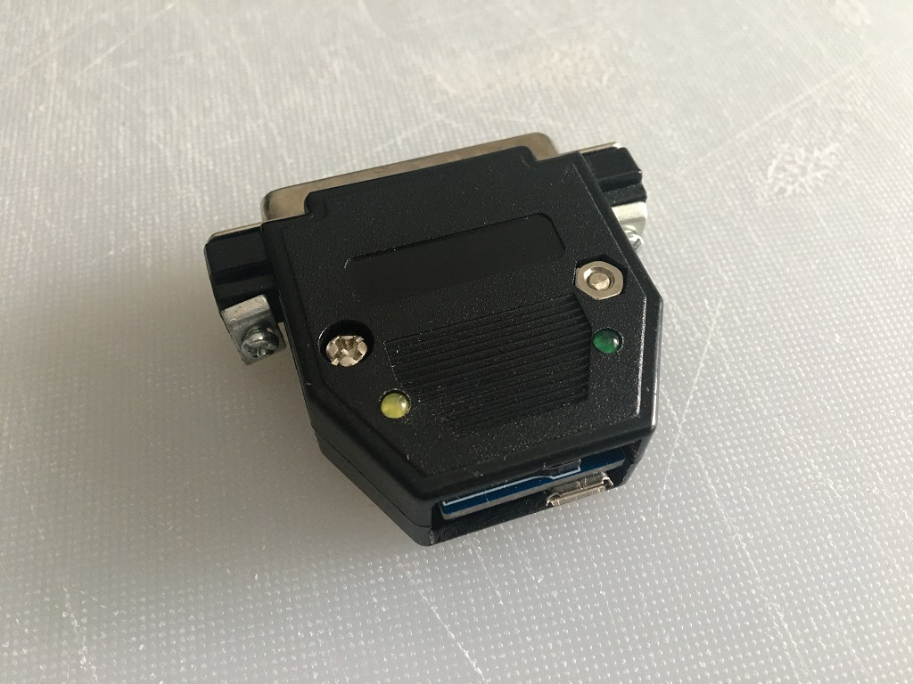
</a>
<br />
Video:<br />
https://drive.google.com/file/d/1fLwmIyUeHZX4sln5bpJfz5QkDGD-QTOf/view?usp=sharing
<br />
<br />
+5V taken from floppy port with this USB-C dongle<br />
https://github.com/jbilander/Amiga_DB23_to_USB_C_power_only_adapter
***
Rev. 2A <br />
<a href="images/SDBox-mini_pic4.jpg">
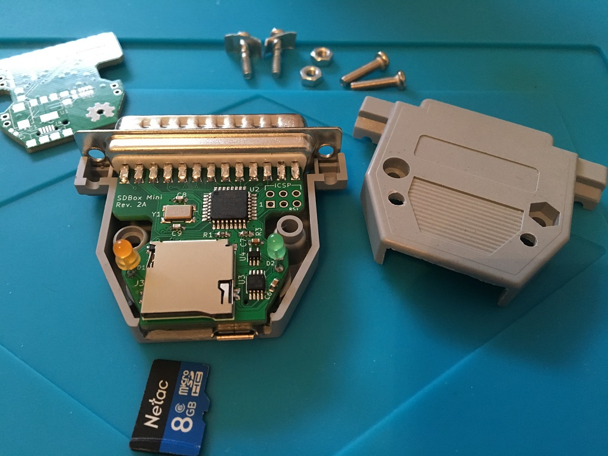
</a>
<a href="images/SDBox-mini_pic5.jpg">
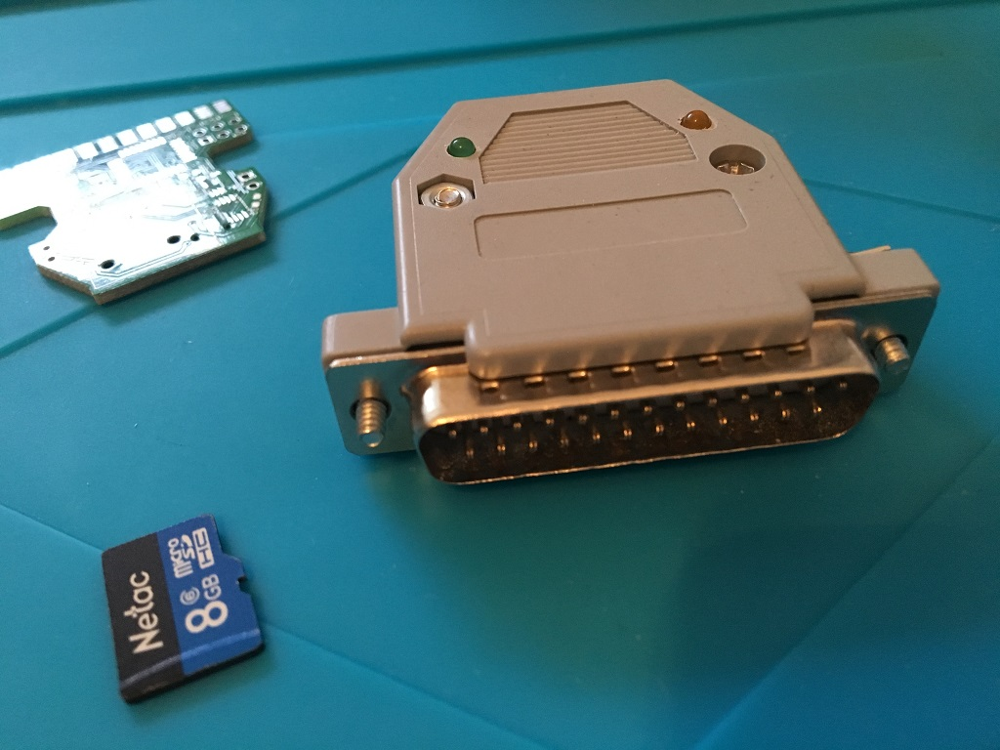
</a>
<br />
<a href="images/SDBox-mini_pic1.png">

</a>
<a href="images/SDBox-mini_pic2.png">

</a>
<a href="images/SDBox-mini_pic3.png">

</a>

***
This hardware uses the firmware written by Niklas Ekström, available here... <br />
https://github.com/niklasekstrom/amiga-par-to-spi-adapter

...or use my fork if you also want the Activity LED to blink (it also includes a batch-script `flashSDBoxMini.bat` for flashing the Mini) <br />
https://github.com/jbilander/amiga-par-to-spi-adapter

***
Connecting the Arduino to program the SDBox Mini

    (Programmer)
    Arduino as ISP - SDBox Mini 
    ------------------------------------
    D13 (SPI) SCK  - Pin 3 (ICSP) SCK
    D12 (SPI) MISO - Pin 1 (ICSP) MISO
    D11 (SPI) MOSI - Pin 4 (ICSP) MOSI
    D10 (SPI) SS   - Pin 5 (ICSP) /RESET
              5V   - Pin 2 VCC
              GND  - Pin 6 GND

On the Nano V3 the pins on the ICSP-header can be utilized connected like below. There is no need to solder an ICSP-header on the mini, you can just hold the connector against the footprint while programming.

<a href="images/connect_nano_ICSP_to_SDBox-mini.jpg">
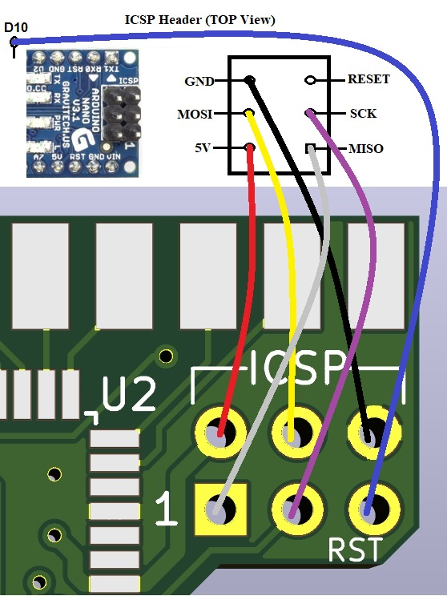
</a>
<a href="images/SDBox-mini_pic8.jpg">
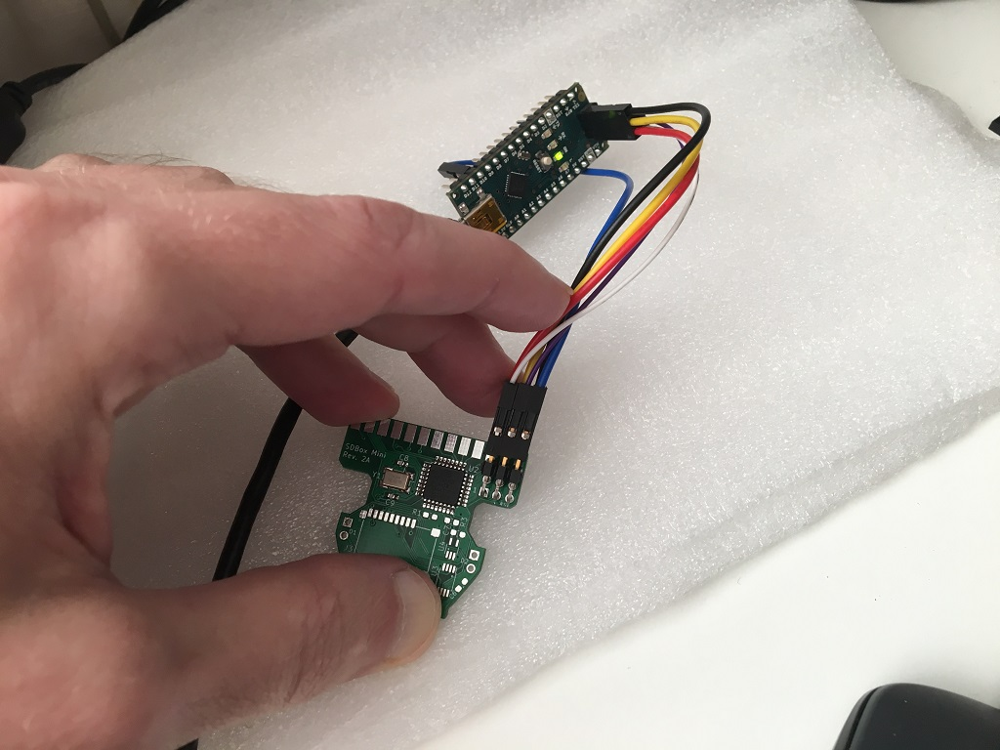
</a>

***

To use the Arduino Nano as ISP it first has to be flashed with the ArduinoISP-sketch which is available under `File->Examples` in the Arduino IDE, or you can use the attached batch-script `flash_Arduino_as_ISP.bat` and binary hex `ArduinoISP.ino.arduino_standard.hex` I have put them in a zip-file under Releases `ArduinoISP.zip`. Alter the com port in the script file to suit your machine and execute it from a command-prompt. Now you are ready to flash the SDBox-Mini via the Arduino.

***

### Flash the SDBox Mini using the Arduino as ISP
This requires that you already have built the `main.hex` file in the `avr`-folder, then execute `flashSDBoxMini.bat` from a command prompt:
<details>
<summary>

    C:\Users\Jorgen\Projects\amiga-par-to-spi-adapter\avr>flashSDBoxMini.bat

</summary>

```
C:\Users\Jorgen\Projects\amiga-par-to-spi-adapter\avr>"C:\Program Files (x86)\Arduino\hardware\tools\avr/bin/avrdude" -C "C:\Program Files (x86)\Arduino\hardware\tools\avr/etc/avrdude.conf" -v -pm328p -cstk500v1 -PCOM4 -b19200 -Uflash:w:main.hex:i -Ulfuse:w:0xe6:m -Uhfuse:w:0xdf:m -Uefuse:w:0xfc:m

avrdude: Version 6.3-20190619
         Copyright (c) 2000-2005 Brian Dean, http://www.bdmicro.com/
         Copyright (c) 2007-2014 Joerg Wunsch

         System wide configuration file is "C:\Program Files (x86)\Arduino\hardware\tools\avr/etc/avrdude.conf"

         Using Port                    : COM4
         Using Programmer              : stk500v1
         Overriding Baud Rate          : 19200
         AVR Part                      : ATmega328P
         Chip Erase delay              : 9000 us
         PAGEL                         : PD7
         BS2                           : PC2
         RESET disposition             : dedicated
         RETRY pulse                   : SCK
         serial program mode           : yes
         parallel program mode         : yes
         Timeout                       : 200
         StabDelay                     : 100
         CmdexeDelay                   : 25
         SyncLoops                     : 32
         ByteDelay                     : 0
         PollIndex                     : 3
         PollValue                     : 0x53
         Memory Detail                 :

                                  Block Poll               Page                       Polled
           Memory Type Mode Delay Size  Indx Paged  Size   Size #Pages MinW  MaxW   ReadBack
           ----------- ---- ----- ----- ---- ------ ------ ---- ------ ----- ----- ---------
           eeprom        65    20     4    0 no       1024    4      0  3600  3600 0xff 0xff
           flash         65     6   128    0 yes     32768  128    256  4500  4500 0xff 0xff
           lfuse          0     0     0    0 no          1    0      0  4500  4500 0x00 0x00
           hfuse          0     0     0    0 no          1    0      0  4500  4500 0x00 0x00
           efuse          0     0     0    0 no          1    0      0  4500  4500 0x00 0x00
           lock           0     0     0    0 no          1    0      0  4500  4500 0x00 0x00
           calibration    0     0     0    0 no          1    0      0     0     0 0x00 0x00
           signature      0     0     0    0 no          3    0      0     0     0 0x00 0x00

         Programmer Type : STK500
         Description     : Atmel STK500 Version 1.x firmware
         Hardware Version: 2
         Firmware Version: 1.18
         Topcard         : Unknown
         Vtarget         : 0.0 V
         Varef           : 0.0 V
         Oscillator      : Off
         SCK period      : 0.1 us

avrdude: AVR device initialized and ready to accept instructions

Reading | ################################################## | 100% 0.07s

avrdude: Device signature = 0x1e950f (probably m328p)
avrdude: safemode: lfuse reads as E6
avrdude: safemode: hfuse reads as DF
avrdude: safemode: efuse reads as FC
avrdude: NOTE: "flash" memory has been specified, an erase cycle will be performed
         To disable this feature, specify the -D option.
avrdude: erasing chip
avrdude: reading input file "main.hex"
avrdude: writing flash (496 bytes):

Writing | ################################################## | 100% 0.68s

avrdude: 496 bytes of flash written
avrdude: verifying flash memory against main.hex:
avrdude: load data flash data from input file main.hex:
avrdude: input file main.hex contains 496 bytes
avrdude: reading on-chip flash data:

Reading | ################################################## | 100% 0.44s

avrdude: verifying ...
avrdude: 496 bytes of flash verified
avrdude: reading input file "0xe6"
avrdude: writing lfuse (1 bytes):

Writing | ################################################## | 100% 0.03s

avrdude: 1 bytes of lfuse written
avrdude: verifying lfuse memory against 0xe6:
avrdude: load data lfuse data from input file 0xe6:
avrdude: input file 0xe6 contains 1 bytes
avrdude: reading on-chip lfuse data:

Reading | ################################################## | 100% 0.02s

avrdude: verifying ...
avrdude: 1 bytes of lfuse verified
avrdude: reading input file "0xdf"
avrdude: writing hfuse (1 bytes):

Writing | ################################################## | 100% 0.02s

avrdude: 1 bytes of hfuse written
avrdude: verifying hfuse memory against 0xdf:
avrdude: load data hfuse data from input file 0xdf:
avrdude: input file 0xdf contains 1 bytes
avrdude: reading on-chip hfuse data:

Reading | ################################################## | 100% 0.02s

avrdude: verifying ...
avrdude: 1 bytes of hfuse verified
avrdude: reading input file "0xfc"
avrdude: writing efuse (1 bytes):

Writing | ################################################## | 100% 0.03s

avrdude: 1 bytes of efuse written
avrdude: verifying efuse memory against 0xfc:
avrdude: load data efuse data from input file 0xfc:
avrdude: input file 0xfc contains 1 bytes
avrdude: reading on-chip efuse data:

Reading | ################################################## | 100% 0.02s

avrdude: verifying ...
avrdude: 1 bytes of efuse verified

avrdude: safemode: lfuse reads as E6
avrdude: safemode: hfuse reads as DF
avrdude: safemode: efuse reads as FC
avrdude: safemode: Fuses OK (E:FC, H:DF, L:E6)

avrdude done.  Thank you.


C:\Users\Jorgen\Projects\amiga-par-to-spi-adapter\avr>

```
</details>

***

### Connecting a RPi4 to program the SDBox Mini

<br />
Warning!<br />
Connection of a GPIO to a voltage higher than 3.3V will likely destroy the GPIO block within the SoC.<br /><br />
I used my <a href="https://github.com/jbilander/Logic-level-converter-board">Logic level converter board</a> in between the devices and powered from the RPi's +5V 
<br />
<br />
<a href="images/SDBox-mini_RPi4-GPIO-Programming.jpg">
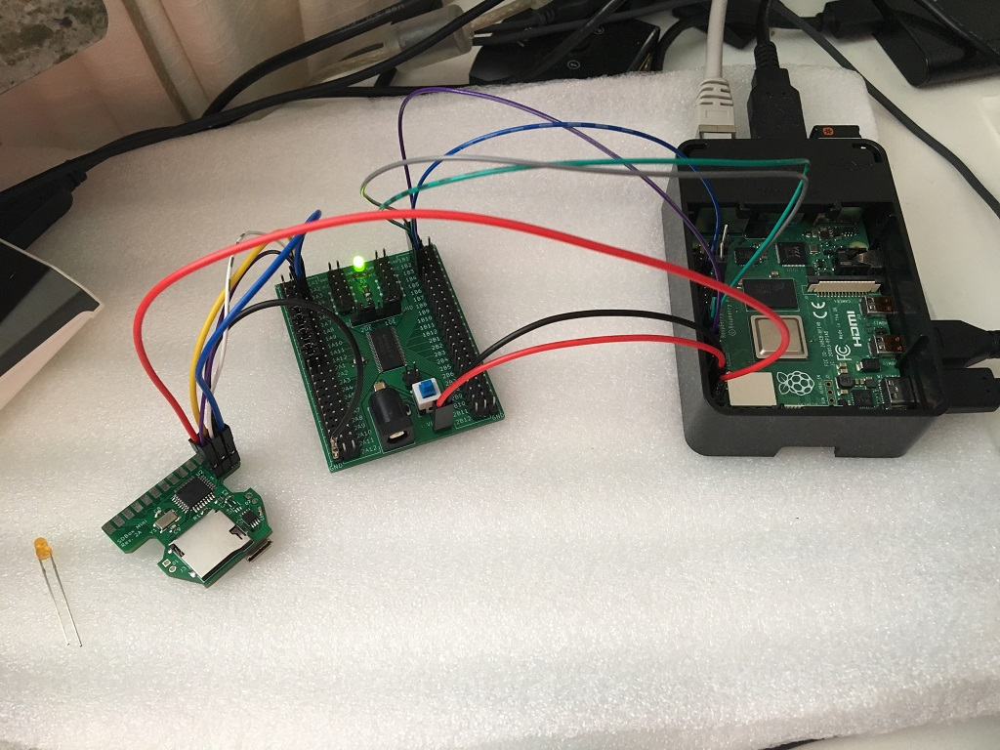
</a>
<a href="images/RPi4-GPIO-Pinout.jpg">
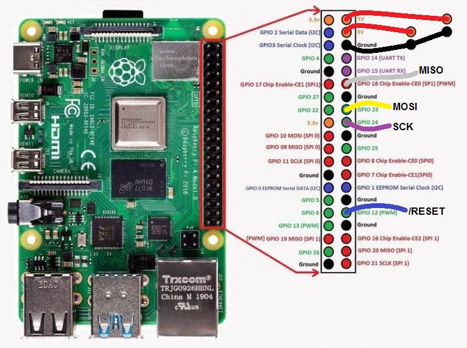
</a>
<br />
First install avrdude:

    sudo apt install avrdude

Now copy the default config file to a new file under /home/pi

    cp /etc/avrdude.conf ~/avrdude_gpio.conf
    
Add this entry last in the file using your editor (vim or nano) and save the file:

    #------------------------------------------------------------
    # Linux GPIO configuration for avrdude
    # Change the lines below to the GPIO pins connected to the AVR
    #------------------------------------------------------------
    programmer
        id        = "pi_1";
        desc      = "Use the Linux sysfs interface to bitbang GPIO lines";
        type      = "linuxgpio";
        reset     = 12;
        sck       = 24;
        mosi      = 23;
        miso      = 18;
    ;

Now cd into /home/pi and make the script-file executable:

    chmod 755 ./flashSDBoxMini.sh

With all jumper-wires connected and `main.hex` built, run the script `flashSDBoxMini.sh` (OR type the line below and hit enter)

    sudo avrdude -C ~/avrdude_gpio.conf -c pi_1 -v -p m328p -Uflash:w:main.hex:i -Ulfuse:w:0xe6:m -Uhfuse:w:0xdf:m -Uefuse:w:0xfc:m

<details>
<summary>

    pi@raspberrypi:~ $ ./flashSDBoxMini.sh

</summary>

```
avrdude: Version 6.3-20171130
         Copyright (c) 2000-2005 Brian Dean, http://www.bdmicro.com/
         Copyright (c) 2007-2014 Joerg Wunsch

         System wide configuration file is "/home/pi/avrdude_gpio.conf"
         User configuration file is "/root/.avrduderc"
         User configuration file does not exist or is not a regular file, skipping

         Using Port                    : unknown
         Using Programmer              : pi_1
         AVR Part                      : ATmega328P
         Chip Erase delay              : 9000 us
         PAGEL                         : PD7
         BS2                           : PC2
         RESET disposition             : dedicated
         RETRY pulse                   : SCK
         serial program mode           : yes
         parallel program mode         : yes
         Timeout                       : 200
         StabDelay                     : 100
         CmdexeDelay                   : 25
         SyncLoops                     : 32
         ByteDelay                     : 0
         PollIndex                     : 3
         PollValue                     : 0x53
         Memory Detail                 :

                                  Block Poll               Page                       Polled
           Memory Type Mode Delay Size  Indx Paged  Size   Size #Pages MinW  MaxW   ReadBack
           ----------- ---- ----- ----- ---- ------ ------ ---- ------ ----- ----- ---------
           eeprom        65    20     4    0 no       1024    4      0  3600  3600 0xff 0xff
           flash         65     6   128    0 yes     32768  128    256  4500  4500 0xff 0xff
           lfuse          0     0     0    0 no          1    0      0  4500  4500 0x00 0x00
           hfuse          0     0     0    0 no          1    0      0  4500  4500 0x00 0x00
           efuse          0     0     0    0 no          1    0      0  4500  4500 0x00 0x00
           lock           0     0     0    0 no          1    0      0  4500  4500 0x00 0x00
           calibration    0     0     0    0 no          1    0      0     0     0 0x00 0x00
           signature      0     0     0    0 no          3    0      0     0     0 0x00 0x00

         Programmer Type : linuxgpio
         Description     : Use the Linux sysfs interface to bitbang GPIO lines
         Pin assignment  : /sys/class/gpio/gpio{n}
           RESET   =  12
           SCK     =  24
           MOSI    =  23
           MISO    =  18

avrdude: AVR device initialized and ready to accept instructions

Reading | ################################################## | 100% 0.00s

avrdude: Device signature = 0x1e950f (probably m328p)
avrdude: safemode: lfuse reads as E6
avrdude: safemode: hfuse reads as DF
avrdude: safemode: efuse reads as FC
avrdude: NOTE: "flash" memory has been specified, an erase cycle will be performed
         To disable this feature, specify the -D option.
avrdude: erasing chip
avrdude: reading input file "main.hex"
avrdude: writing flash (496 bytes):

Writing | ################################################## | 100% 0.11s

avrdude: 496 bytes of flash written
avrdude: verifying flash memory against main.hex:
avrdude: load data flash data from input file main.hex:
avrdude: input file main.hex contains 496 bytes
avrdude: reading on-chip flash data:

Reading | ################################################## | 100% 0.10s

avrdude: verifying ...
avrdude: 496 bytes of flash verified
avrdude: reading input file "0xe6"
avrdude: writing lfuse (1 bytes):

Writing | ################################################## | 100% 0.00s

avrdude: 1 bytes of lfuse written
avrdude: verifying lfuse memory against 0xe6:
avrdude: load data lfuse data from input file 0xe6:
avrdude: input file 0xe6 contains 1 bytes
avrdude: reading on-chip lfuse data:

Reading | ################################################## | 100% 0.00s

avrdude: verifying ...
avrdude: 1 bytes of lfuse verified
avrdude: reading input file "0xdf"
avrdude: writing hfuse (1 bytes):

Writing | ################################################## | 100% 0.00s

avrdude: 1 bytes of hfuse written
avrdude: verifying hfuse memory against 0xdf:
avrdude: load data hfuse data from input file 0xdf:
avrdude: input file 0xdf contains 1 bytes
avrdude: reading on-chip hfuse data:

Reading | ################################################## | 100% 0.00s

avrdude: verifying ...
avrdude: 1 bytes of hfuse verified
avrdude: reading input file "0xfc"
avrdude: writing efuse (1 bytes):

Writing | ################################################## | 100% 0.00s

avrdude: 1 bytes of efuse written
avrdude: verifying efuse memory against 0xfc:
avrdude: load data efuse data from input file 0xfc:
avrdude: input file 0xfc contains 1 bytes
avrdude: reading on-chip efuse data:

Reading | ################################################## | 100% 0.00s

avrdude: verifying ...
avrdude: 1 bytes of efuse verified

avrdude: safemode: lfuse reads as E6
avrdude: safemode: hfuse reads as DF
avrdude: safemode: efuse reads as FC
avrdude: safemode: Fuses OK (E:FC, H:DF, L:E6)

avrdude done.  Thank you.

pi@raspberrypi:~ $

```
</details>

***

### Caveats

One caveat to keep in mind when building and programming Rev.2A (the first revision of the Mini) is the flashing of the fw can't be done with U4 chip in place as it drives/conflicts with MISO on ICSP (In-Circuit Serial Programming). For Rev. 2B PCB use 74AHCT1G126 instead of 74LVC1G17, same package/footprint. This solves the flashing conflict problem. You put a Jumper-shunt on JP1 (on Rev 2B PCB) while flashing and remove it afterwards.

***

### Building SDBox Mini

Start with the 16 MHz Crystal, C8, C9 and the ATMega328P. 

<a href="images/SDBox-mini_pic6.jpg">
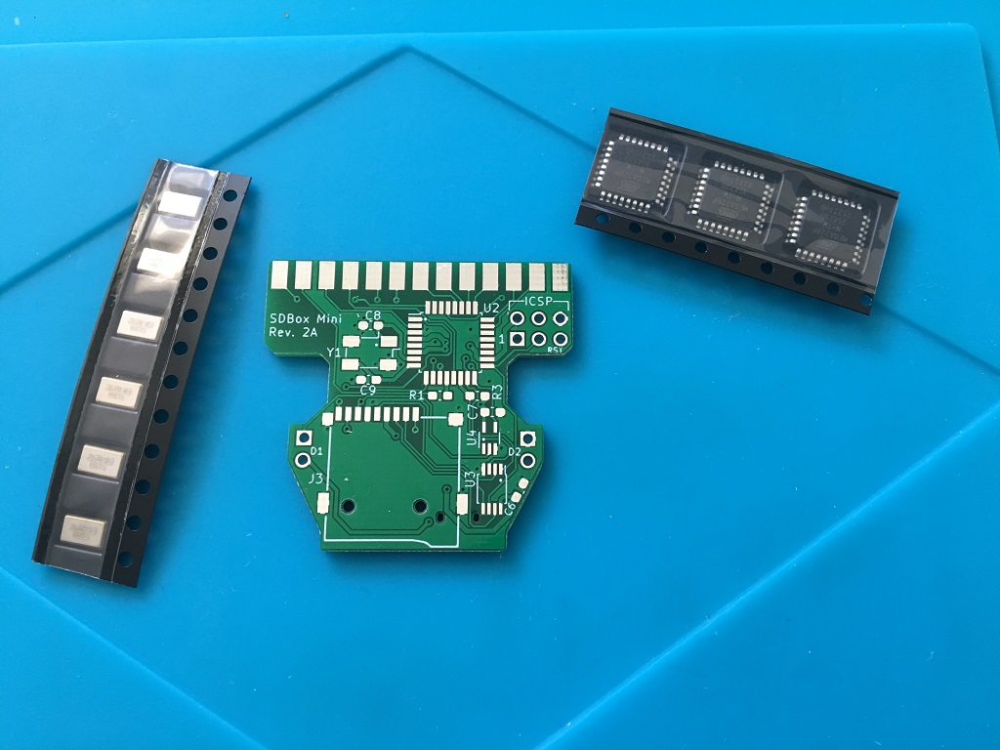
</a>
<a href="images/SDBox-mini_pic7.jpg">
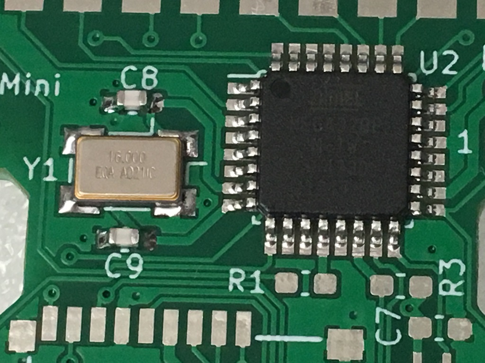
</a>

***

At this point you should be able to flash the Firmware to the ATMega using either an Arduino as ISP or a Raspberry Pi.<br /><br />

Continue with the rest of the components on the front side, and then the back side. I usually pre-tin the C1 pads and use hot air to put the C1-Capacitor in place.
***

<a href="images/SDBox-mini_pic9.jpg">
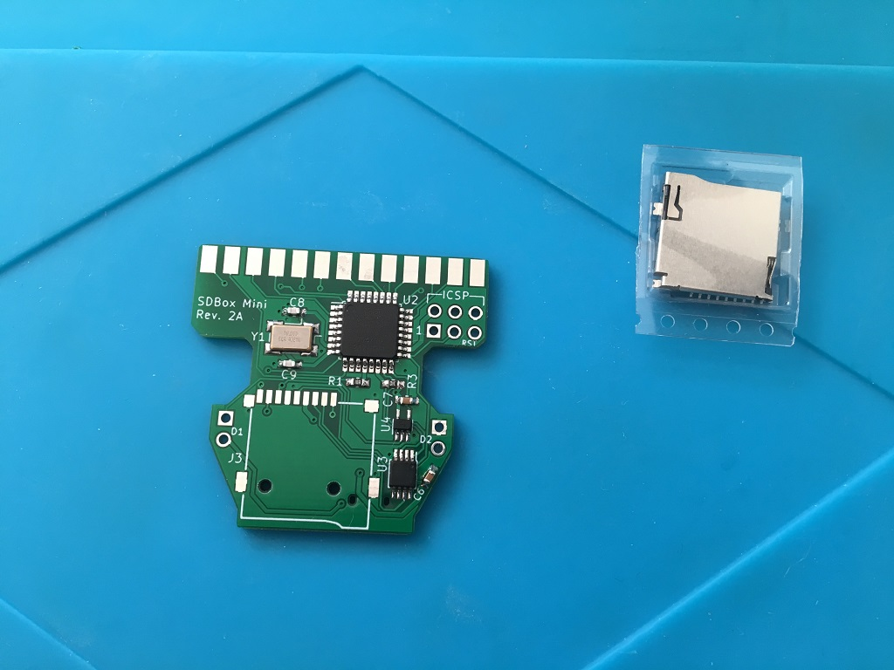
</a>
<a href="images/SDBox-mini_pic10.jpg">
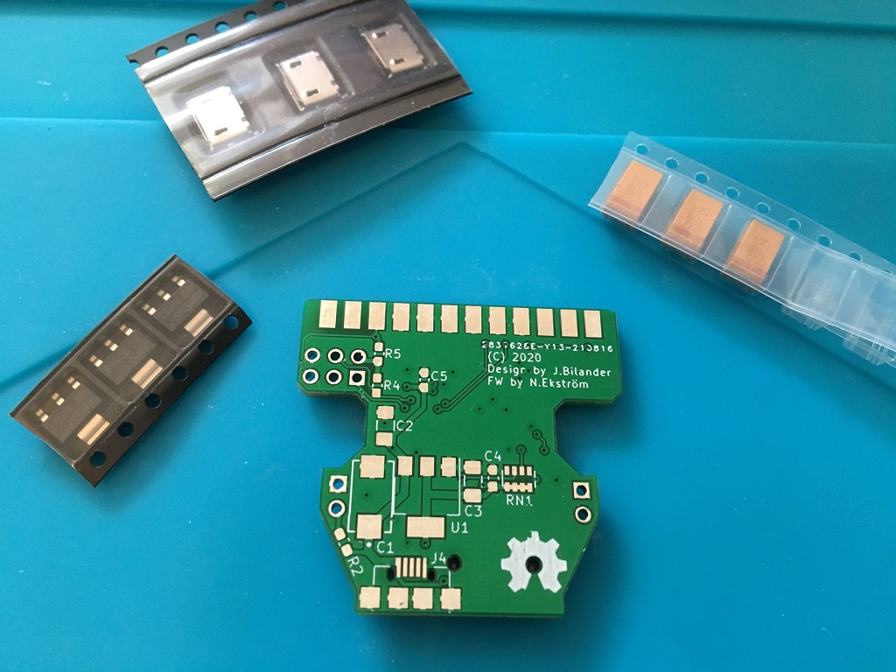
</a>
<a href="images/SDBox-mini_pic11.jpg">
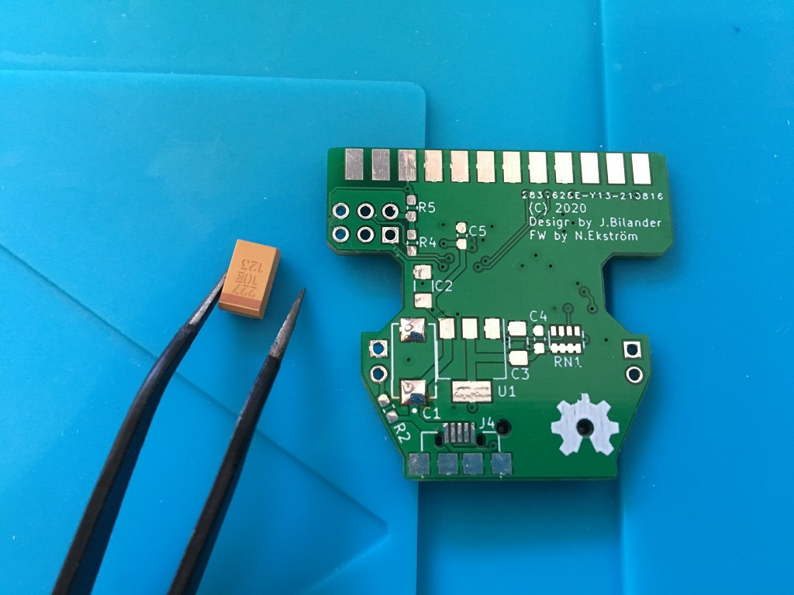
</a>

***

Verify the Micro USB-jack and the voltage levels...

***

<a href="images/SDBox-mini_pic12.jpg">
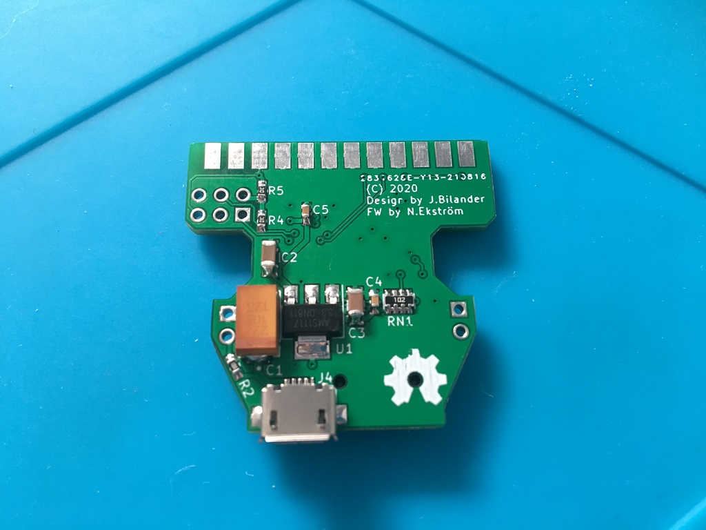
</a>
<a href="images/SDBox-mini_pic13.jpg">
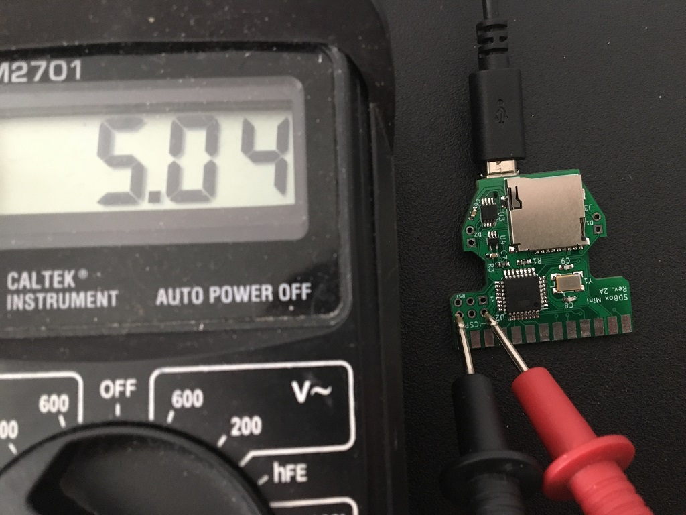
</a>
<a href="images/SDBox-mini_pic14.jpg">
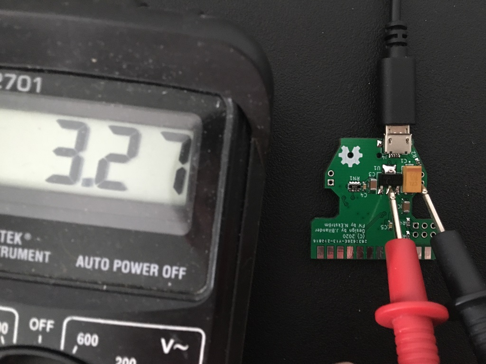
</a>

***

Now it's time to drill the holes for the LEDs, begin with a 1 mm drill and then step up to 2 mm and finally 3 mm. Be very careful when drilling to get a nice clean 3mm hole, it's very easy to slip and the hole gets oval or offset.

***

<a href="images/SDBox-mini_pic15.jpg">
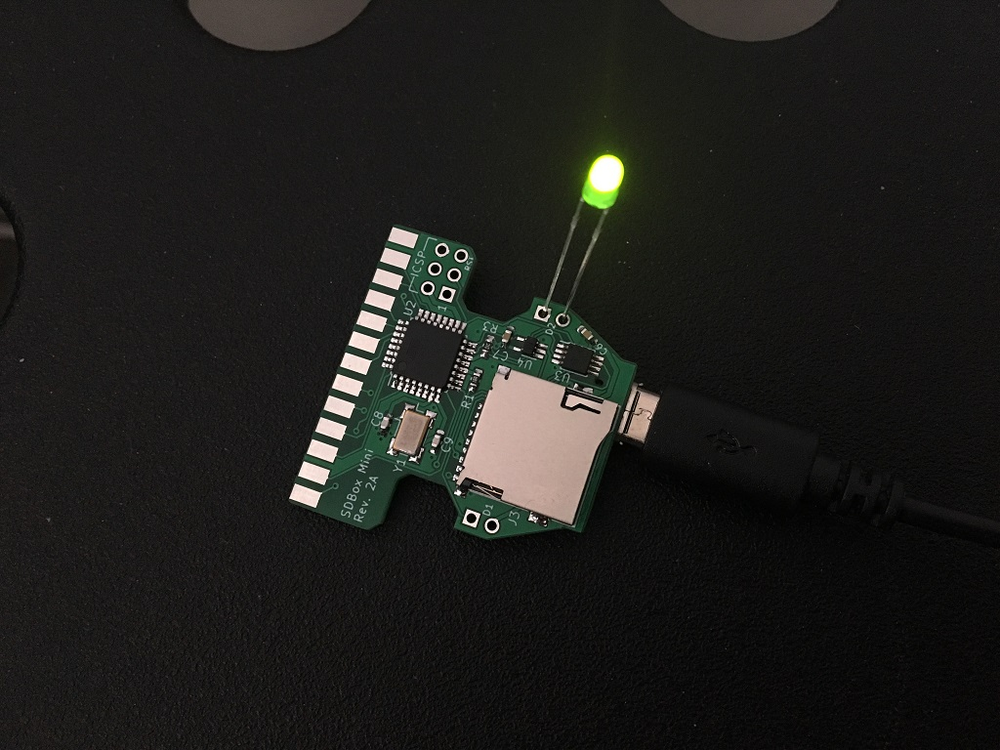
</a>
<a href="images/SDBox-mini_pic16.jpg">
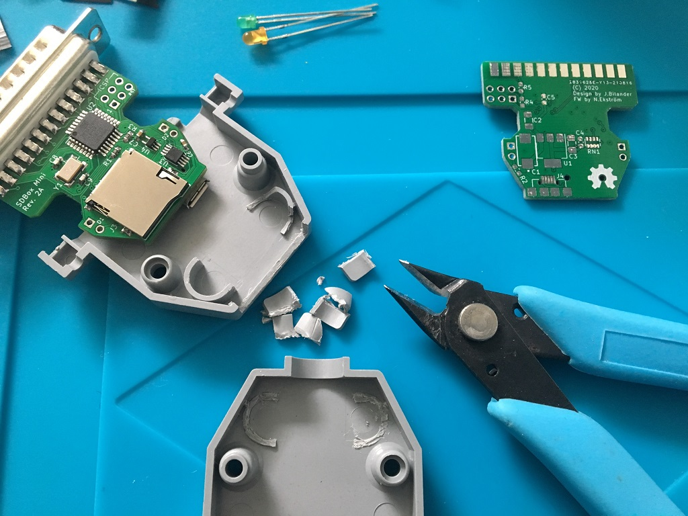
</a>
<a href="images/SDBox-mini_pic17.jpg">
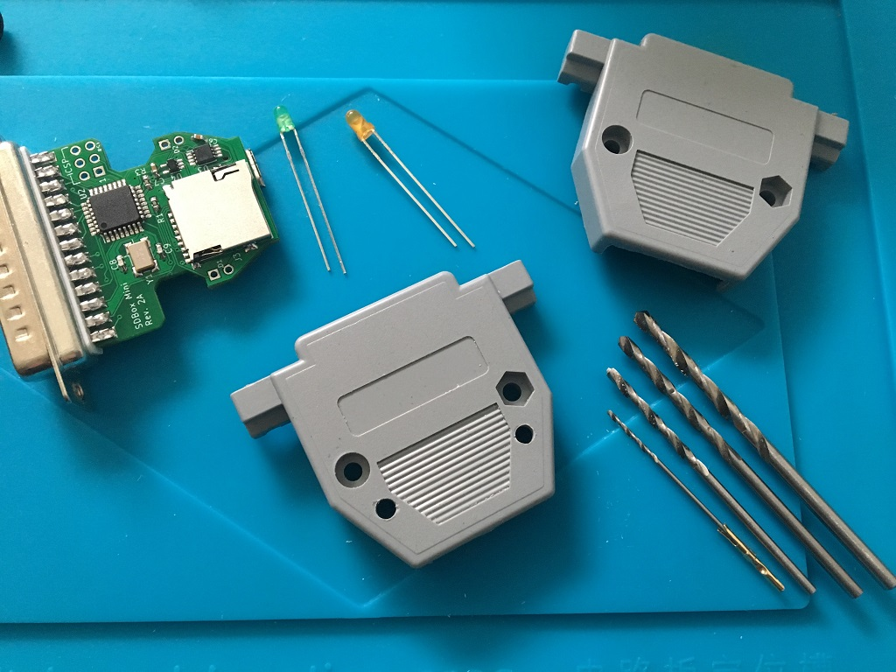
</a>

***

Short video showing copying a 8 MB file from the HD to the SD-card on my A1200. +5V to power the SDBox I nicked from the floppy port DB23->microUSB (Howto make such a cable <a href="https://github.com/jbilander/SDBox-v2#howto-get-5v-from-the-amigas-external-floppy-port-250-ma-max-lets-make-a-cable">here</a> ).
<br />
Video:<br />
https://i.imgur.com/mF9Bp4C.mp4

***

<a href="images/SDBox-mini_pic4.jpg">

</a>
<a href="images/SDBox-mini_pic18.jpg">
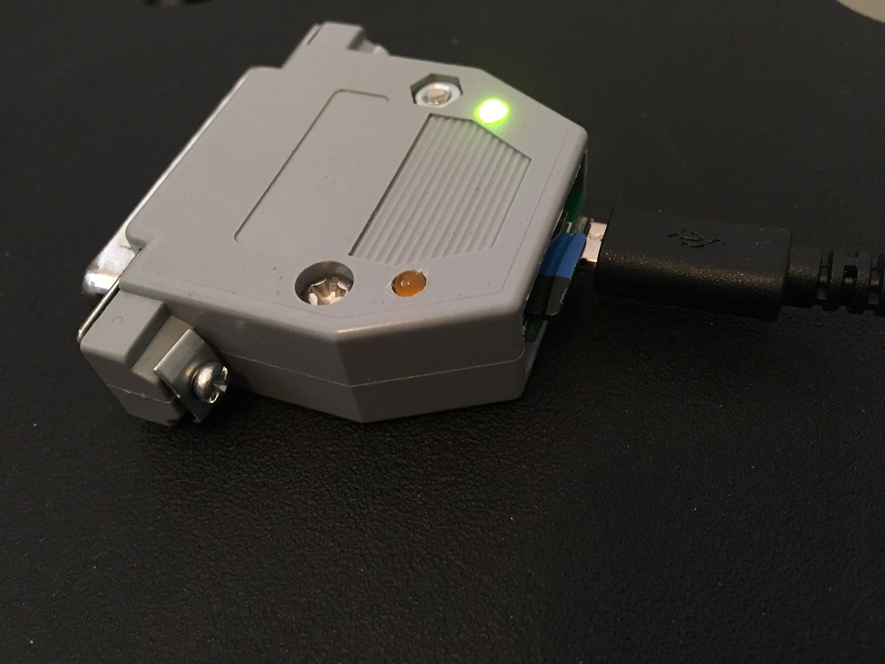
</a>
<a href="images/SDBox-mini_pic19.jpg">
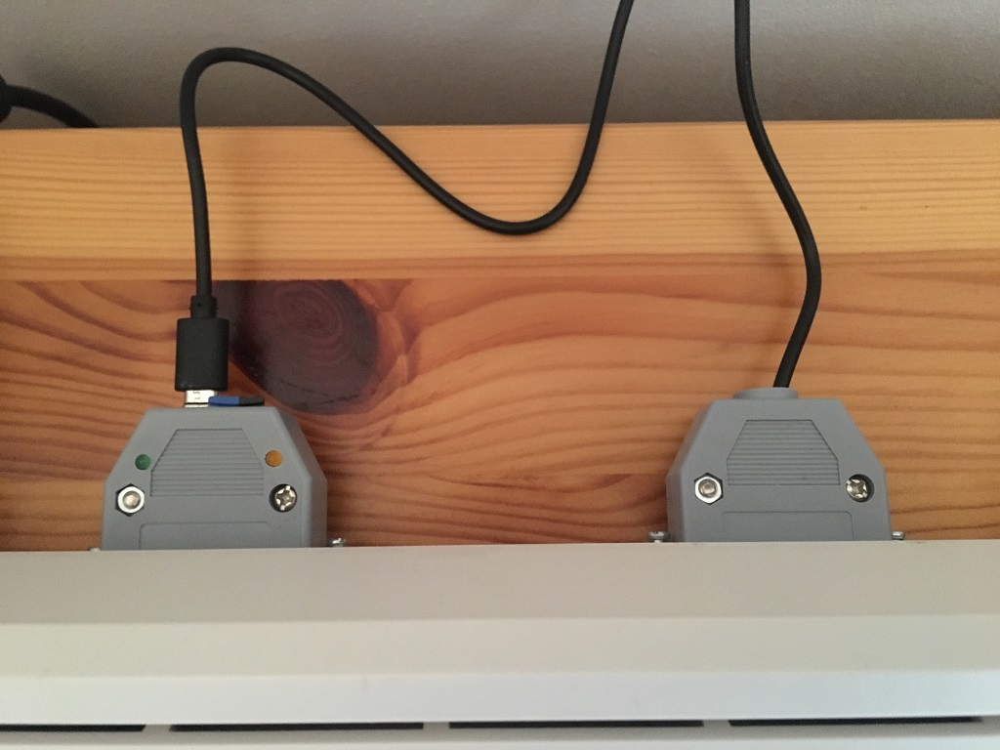
</a>

***

### Amiga installation:

Download `Amiga.zip` from Releases.

* Put latest `fat95` into `L:`  (download from Aminet)
* Put `SD0` and `SD0.info` into `Devs:`  (from `Amiga.zip`)
* Put `spisd.device` into `Devs:` (from `Amiga.zip`)
* Put `Mount_SDCARD` and `Mount_SDCARD.info` anywhere on your HD or floppy disk.
* Put a FAT/FAT32 formatted MicroSD-card in the card reader (Max 4 GB partitioned).
* Double-click the `Mount_SDCARD` icon.

Disk icon should now appear on the Workbench screen.

***

Happy Hackin´

***
BOM Rev. 2B  (Same as 2A with the addition)
---------
Position  | Name/Value   | Package | Notes
-|-|-|-|
U4 | 74AHCT1G126 | 5-TSSOP, SC-70-5, SOT-353  (2.0 mm × 1.25mm) | Single non-inverting buffer 74AHCT1G126 (instead of 74LVC1G17) https://www.mouser.com/ProductDetail/Nexperia/74AHCT1G126GW125?qs=P62ublwmbi%252BsCpFPoi5fgw%3D%3D 
JP1 | 2.0mm two-pin header + jumper-shunt | |
R6 | 10k Ohm Resistor | 0603 SMD | Pull-up resistor for OE pin 1 of 74AHCT1G126

***

BOM Rev. 2A
---------
Position  | Name/Value   | Package | Notes
-|-|-|-|
U1 | LM1117-3.3 | SOT-223 | Low-Dropout Linear Regulator 3.3 Volt
U2 | ATMega328P-AU | TQFP-32_7x7mm_P0.8mm | 8-bit AVR Microcontroller with 32K Bytes In-System Programmable Flash
U3 | 74LVC3G17 | TSSOP-8_3x3mm_P0.65mm | Triple non-inverting Schmitt trigger with 5V tolerant input https://www.digikey.se/product-detail/en/nexperia-usa-inc/74LVC3G17DP-125/1727-5998-1-ND/2753830
U4 | 74LVC1G17 | 5-TSSOP, SC-70-5, SOT-353  (2.0 mm × 1.25mm) | Single non-inverting Schmitt trigger https://www.digikey.se/product-detail/en/nexperia-usa-inc/74LVC1G17GW-125/1727-4117-1-ND/1965408 For Rev. 2B PCB use 74AHCT1G126 instead of 74LVC1G17, same package/footprint: https://www.mouser.com/ProductDetail/Nexperia/74AHCT1G126GW125?qs=P62ublwmbi%252BsCpFPoi5fgw%3D%3D
J1 | D-Sub DB25 | DB25 Male connector with solder lugs | DB25 for Amiga parallel port
J2 | ICSP | PinHeader_2x03_P2.54mm_Vertical | Pin header _(MISO,VCC,SCK,MOSI,/RESET,GND)_ for flashing AVR via In-Circuit Serial Programming
J3 | Micro SD Card Holder | 9-pin Micro SD card slot connector | https://www.aliexpress.com/item/32802051702.html
J4 | Micro USB connector | USB Micro B SMT | For +5V Power only <br />https://www.aliexpress.com/item/32991869539.html
Y1 | Ceramic SMD quartz 16.0 MHz, LC 12 pF | 3 x 5 x 1 mm | For use with XTAL1, XTAL2 on AVR, e.g. https://www.reichelt.com/se/en/ceramic-smd-quartz-3-x-5-x-1-mm-16-0-mhz-16-000000-mj-p85005.html <br /> or <br /> https://www.mouser.se/ProductDetail/520-160-12-30B-AGMT
D1 (Optional) | LED 3mm | PinHeader_1x02_P2.54mm_Vertical, pin pitch 2.54 mm | SD Activity LED indicator, Diffused Orange / Amber, 1.8V-2.3V, 20-30 mA, 605-610nm
D2 (Optional) | LED 3mm | PinHeader_1x02_P2.54mm_Vertical, pin pitch 2.54 mm | Power LED indicator, Green Diffused T-1, 25 mcd, 565 nm, 2.2 V, 25 mA
R1 (Optional) | 150 Ohm Resistor | 0603 SMD, 200 mW | (Mandatory if D1 populated) Series resistor for D1 LED, adjust R-value to your type of LED and preferred brightness
R2 (Optional) | 150 Ohm Resistor | 0603 SMD, 200 mW | (Mandatory if D2 populated) Series resistor for D2 LED, adjust R-value to your type of LED and preferred brightness
R3 | 10k Ohm Resistor | 0603 SMD | Pull-up (to VCC) resistor for /SS
R4 (Optional) | 10k Ohm Resistor | 0603 SMD | Pull-up (to VCC) resistor for MOSI
R5 (Optional) | 10k Ohm Resistor | 0603 SMD | Pull-up (to VCC) resistor for /RESET
RN1 | CAY16-103J4LF RES ARRAY 4 Resistors 10k | 1206 SMD | https://www.digikey.se/product-detail/sv/bourns-inc/CAY16-103J4LF/CAY16-103J4LFCT-ND/
RN1 | | | Pull-up (to 3V3) for MISO_3V3
RN1 | | | Pull-up (to 3V3) for DAT1 pin 8 on MicroSD-holder
RN1 | | | Pull-up (to 3V3) for DAT2 pin 1 on MicroSD-holder
C1 | 220uF Capacitor | SMD-Tantalum, 4.3 x 7.3 x 2.8 mm | Capacitor for VIN +5V Power via USB https://www.reichelt.com/se/en/smd-tantalum-220-f-10v-125-c-t491d-220u-10-p206492.html
C2 | 10uF Capacitor | 1206 SMD | Capacitor (VCC) for Voltage regulator U1
C3 | 10uF Capacitor | 1206 SMD | Capacitor (3V3) for Voltage regulator U1
C4 | 0.1uF = 100nF Capacitor | 0603 SMD | Capacitor (3V3) for Voltage regulator U1
C5 | 0.1uF = 100nF Capacitor | 0603 SMD | Decoupling capacitor for U2
C6 | 0.1uF = 100nF Capacitor | 0603 SMD | Decoupling capacitor for U3
C7 | 0.1uF = 100nF Capacitor | 0603 SMD | Decoupling capacitor for U4
C8 | 16pF Capacitor | 0603 SMD | Capacitor for XTAL1 (Y1)
C9 | 16pF Capacitor | 0603 SMD | Capacitor for XTAL2 (Y1)
X | D-Sub DB25 | Two DB25 plastic shells with screws and nuts | Plastic hood cover x 2
