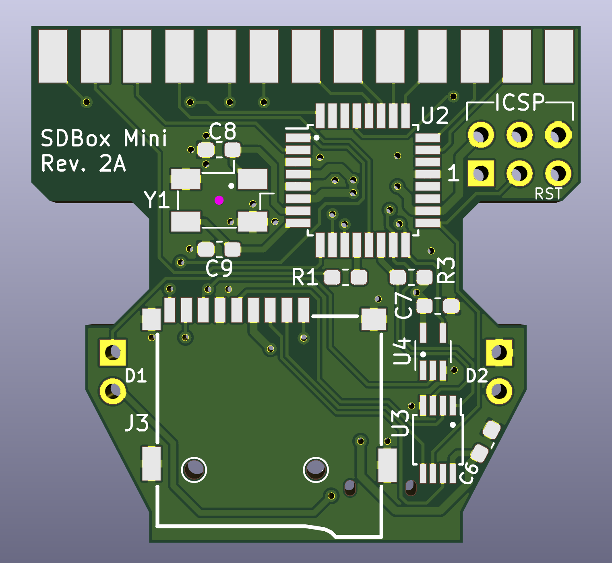
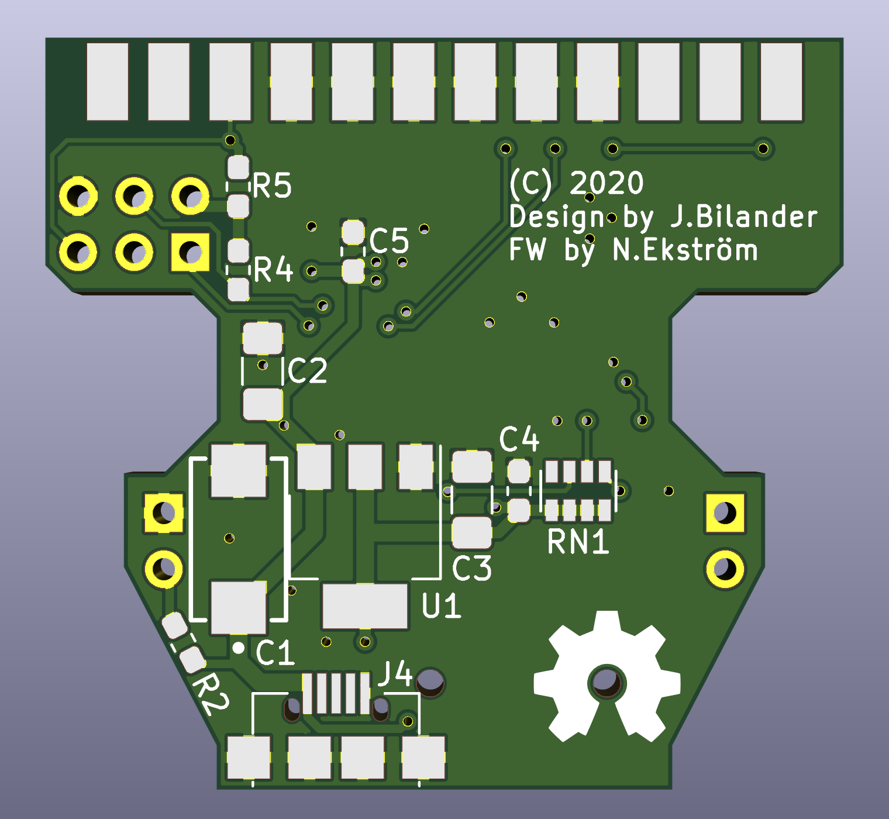
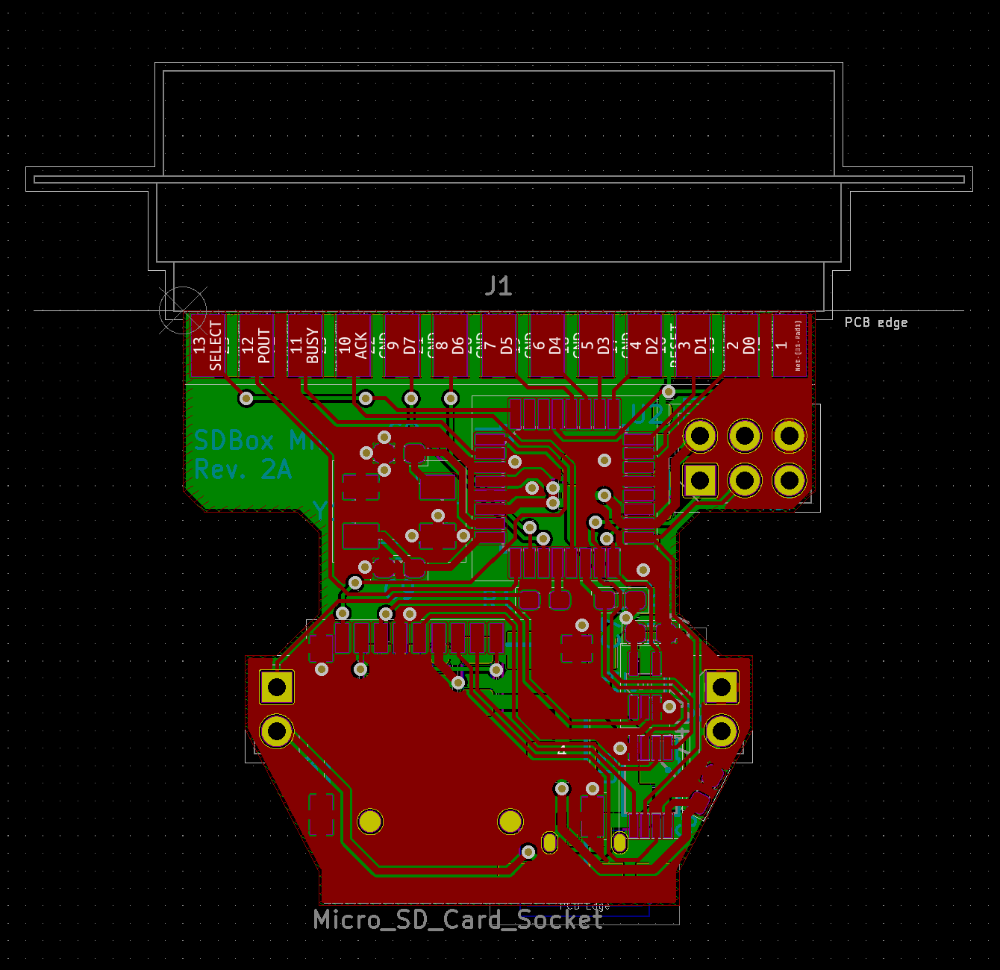

# SDBox-mini for Amiga
SDBox in a standard DB25 plastic shroud

 

***

BOM Rev. 1A
---------
Position  | Name/Value   | Package | Notes
-|-|-|-|
U1 | ATMega328P-AU | TQFP-32_7x7mm_P0.8mm | 8-bit AVR Microcontroller with 32K Bytes In-System Programmable Flash
